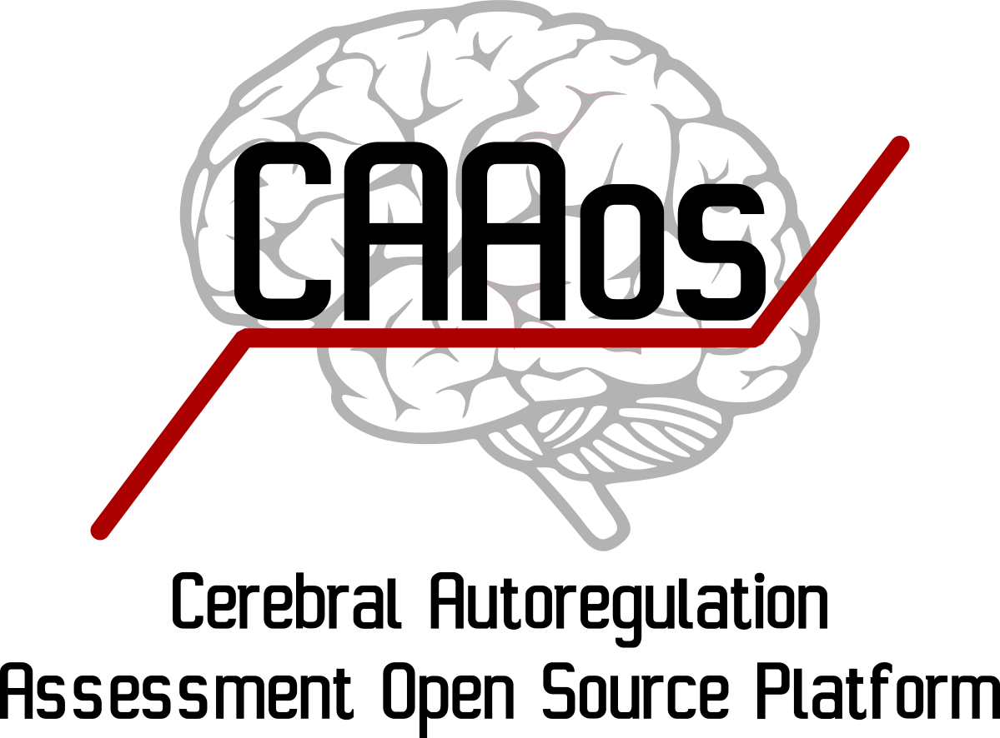

Welcome to the official repository of CAAos Platform (Cerebral Autoregulation Assessment Open Source Platform)!

CAAos is an unified open source, cross-platform toolbox written in Python for processing and analysing cerebral autoregulation datasets from diverse clinical protocols and acquisition modalities. This is a new free software research tool that combines existing and novel methods for interactive visual inspection, batch processing and analysis of multichannel records. As open-source software, the source code is freely available for non-commercial use, reducing barriers to performing CA analysis, allowing inspection of the inner-workings of the algorithms and facilitating networked activities with common standards.

Detailed documentation is available here: <https://caaosplatform.github.io/CAAos>
