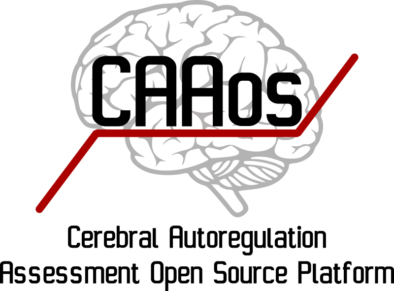

.. CAAos Platform documentation master file, created by
   sphinx-quickstart on Wed Aug  7 14:04:25 2019.
   You can adapt this file completely to your liking, but it should at least
   contain the root `toctree` directive.

Welcome to CAAos Platform's documentation!
******************************************

CAAos is an unified open source, cross-platform toolbox written in Python3 for processing and analysing cerebral autoregulation datasets from diverse clinical protocols and acquisition modalities. This is a new free software research tool that combines existing and novel methods for interactive visual inspection, batch processing and analysis of multichannel records. As open-source software, the source code is freely available for non-commercial use, reducing barriers to performing CA analysis, allowing inspection of the inner-workings of the algorithms and facilitating networked activities with common standards.

.. image:: https://zenodo.org/badge/DOI/10.5281/zenodo.4891862.svg
      :target: https://doi.org/10.5281/zenodo.4891862

Contents:
==========================================

.. toctree::
   :caption: Tutorials
   :maxdepth: 2

   ./tutorials.rst

`Main Features`_

`Installation and requirements`_

`Preprocessing Operations (.PPO) file format`_

`Module definitions`_

`Indices and tables`_

Installation and requirements
==========================================

.. warning:: Installation instructions here

.. _ppo_file_format_label:

Preprocessing Operations (.PPO) file format
===========================================

.. warning:: PPO file format here

        All the operations applied are stored in :attr:`operationsXML`, a :mod:`xml.etree.ElementTree` instance. This function saves all operations stored to a text file. This allows for re-run the analysis on the same file, or apply the same set of operations to different cases.

Module definitions
==================

In this section all modules will be described

patientData
----------------------

.. automodule:: patientData
    :members:
    :undoc-members:
    :show-inheritance:

signals
----------------------

.. automodule:: signals
    :members:
    :undoc-members:
    :show-inheritance:

Indices and tables
==================

* :ref:`genindex`
* :ref:`modindex`
* :ref:`search`
